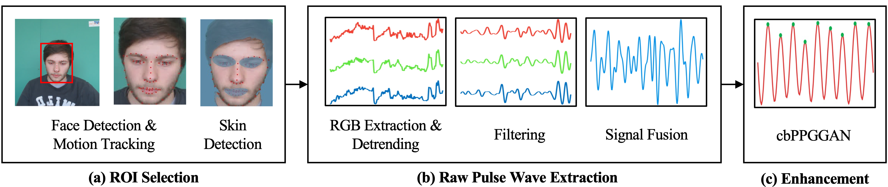

# cbPPGGAN
* This open-source repository provides an enhancement framework for camera-based pulse waveform

* As per our commitment to open science and reproducibility, we will release the source code for the framework once the associated research paper is published.